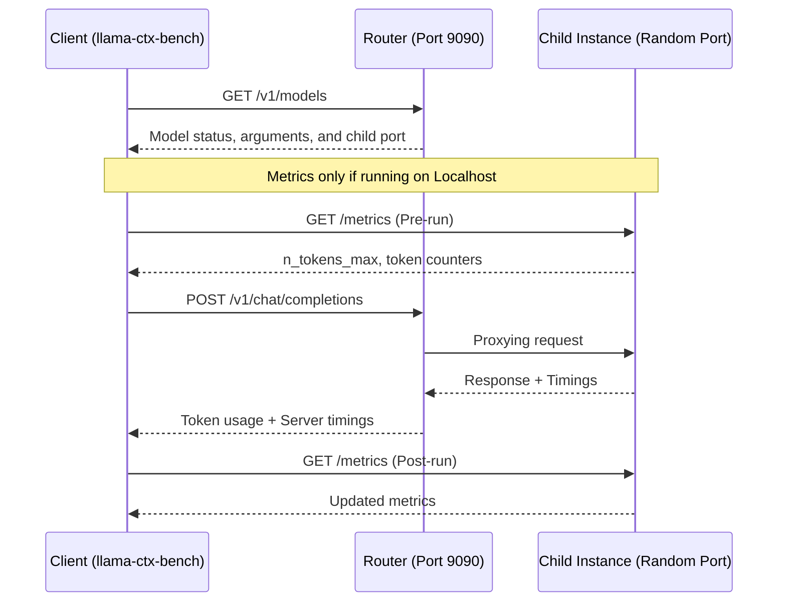

# llama-ctx-bench

A bash script for testing `llama.cpp` server's context handling under load. It supports both standalone servers and the **router mode** (`--models-dir`). It sends context-fill requests of configurable size and reports timing, token usage, and server-side KV cache metrics.

## Requirements

- **curl** - for HTTP requests
- **jq** - for JSON parsing
- **bc** - for floating-point arithmetic
- **python3** - for timestamp generation and string manipulation

Install on Debian/Ubuntu:
```bash
sudo apt install curl jq bc python3
```

The script runs from any machine. It connects to a `llama.cpp` server over HTTP. No GPU or `llama.cpp` installation is needed on the client side.

## Usage

```bash
./llama-ctx-bench.sh -m <model_name> [options]
```

### Options

| Flag | Description | Default |
|------|-------------|---------|
| `-m MODEL` | Model name as registered in the router | (required) |
| `-h HOST` | Server hostname or IP | localhost |
| `-p PORT` | Server/Router port | 8080 |
| `-c TOKENS` | Target context size in tokens | 32000 |
| `-t TIMEOUT` | Request timeout in seconds | 600 |
| `-r RATIO` | Character-to-token ratio for prompt generation | 4.5 |
| `--help` | Show usage help | - |

### Examples

Test locally with default settings:
```bash
./llama-ctx-bench.sh -m my-model
```

Test against a remote router with 64k context:
```bash
./llama-ctx-bench.sh -h 192.168.2.180 -p 9090 -m Qwopus3.5-9B-v3 -c 64000
```

## How It Works

The script performs a 4-step test:

1.  **Status Check**: Verifies the server/router is alive and fetches model status via `/v1/models`. It identifies the model's child process port and startup configuration (batch size, flash attention, etc.).
2.  **Pre-request Metrics**: Captures available metrics from the child instance's `/metrics` endpoint (e.g., n_tokens_max).
3.  **Context-fill Request**: Sends a large prompt scaled to exactly fill the target token count.
4.  **Results**: Reports token counts, high-precision timings, and available server metrics.

### The Request

The script generates a repetitive text prompt ("The quick brown fox...") scaled to fill the target token count using a **4.5x character-to-token ratio** (tuned for modern BPE tokenizers). It uses the chat completions API with:
- `max_tokens: 10` - Only generates 10 tokens to isolate prefill timing.
- `temperature: 0` - Deterministic output.
- `stream: false` - Single response.

## Output Explained

### Configuration & Context
- **Batch config**: Shows the server's `--batch-size`, `--ubatch-size`, and `--parallel` settings.
- **Cache config**: Shows `--cache-reuse` and `--cache-ram` settings.
- **Flash attention**: Indicates if Flash Attention is enabled on the server.
- **Configured ctx**: The maximum context size allowed by the model startup arguments.

### Token Counts
- **Prompt tokens**: Actual tokens in the input prompt.
- **Cached tokens**: Tokens recovered from KV cache (a "cache hit" indicates the data was already in memory).
- **Fresh processed**: Tokens that required fresh computation (Prompt - Cached).

### Timings
- **Wall clock total**: End-to-end request time including network latency.
- **Prefill time**: Time spent processing the input prompt (with sub-millisecond precision).
- **Prefill speed**: Tokens per second for the prefill phase (calculated server-side).
- **Generate time**: Time spent generating output tokens.
- **Generate speed**: Tokens per second for the generation phase.

### Server Metrics
Metrics are sourced from the child process's `/metrics` endpoint:
- **n_tokens_max**: High watermark of observed context size.
- **prompt_tokens_total**: Cumulative prompt tokens processed.
- **tokens_predicted_total**: Cumulative generation tokens processed.

Note: KV cache usage metrics (`llamacpp:kv_cache_*`) are documented in llama.cpp but not implemented in current server builds. A warning will be shown if these metrics are unavailable.

## Limitations

### Remote Metrics
Child process ports in `llama.cpp` router mode are bound to `127.0.0.1` on the server host. If you are running this script from a remote machine, the `/metrics` and `/props` endpoints will be unreachable. The script will automatically skip these steps and report only the completion results.

To see full metrics for a remote server, run the script directly on the server host or use an SSH tunnel for the child port.

### Multi-GPU
On multi-GPU setups, KV cache metrics reflect total usage across all GPUs. There is no per-GPU breakdown.

## Architecture



## Exit Codes

- `0` - Success
- `1` - Error (server unreachable, requested model not found, request failed)
